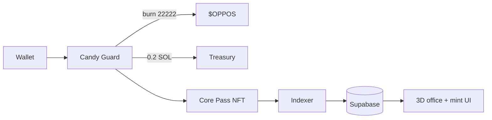

<p align="center">
  
</p>

<h1 align="center">OPPOS</h1>

<p align="center">
  <strong>First-person 3D office on Solana.</strong><br />
  Burn <code>$OPPOS</code>, mint a Pass, hold a share of creator fees.
</p>

<p align="center">
  <a href="https://oppos.app">oppos.app</a>
  ·
  <a href="https://x.com/OpposApp">X</a>
  ·
  <a href="https://github.com/OpposApp/OpposApp">GitHub</a>
</p>

<p align="center">
  
  
  
  
  
</p>

---

Walk the studio. Sit at the desk. Open the treasury chest. Mint from the terminal.

OPPOS is a React + Three.js dApp: a lock-mouse office you can actually use, wired to a Metaplex Core Candy Machine. One Pass is one equal share of **50% of $OPPOS creator fees**, designed to pay out in SOL on a 6-hour clock.

**Token contract:** [`Ay25n6nkFGib2qXLsbqAPhiU81ubuEvDWyVksECRpump`](https://pump.fun/coin/Ay25n6nkFGib2qXLsbqAPhiU81ubuEvDWyVksECRpump). Payout job is designed, not live yet.

## Economics

| | |
| --- | --- |
| Pass supply | **2,222** |
| Mint | Burn **22,222 $OPPOS** + pay **0.2 SOL** to treasury |
| Mint tax | None — Candy Guard only |
| Secondary royalty | **2.2%** on Magic Eden / Tensor (collection Royalties plugin) |
| Holder split | **50%** creator fees → Pass holders |
| Dev / ops | 20% / 30% |
| Payout clock | 00:00 · 06:00 · 12:00 · 18:00 UTC |

Mint is one atomic transaction. Guards enforce burn + SOL. The client cannot skip them.

## Studio

| Key | Action |
| --- | --- |
| Click | Lock mouse look |
| `W A S D` | Walk |
| `Shift` | Sprint |
| `E` | Interact |
| `ESC` | Release mouse / pause |

Hotspots: mint terminal, treasury vault, Pass art, docs, roadmap, rewards, radio, bed.

Desktop first-person. `/mint`, `/rewards`, `/docs` work on any device.

## Stack

```
React 19 · Vite 6 · R3F / Three.js
Privy (Solana wallets)
Metaplex Core Candy Machine + Candy Guard
Supabase (config, passes, stats)
Helius (indexer RPC / DAS snapshots)
```



## Status

| Piece | State |
| --- | --- |
| 3D office | Shipped |
| Pass mint (devnet) | Working |
| Mint indexer | Code ready — run `index-mints:watch` |
| $OPPOS CA | `Ay25n6nkFGib2qXLsbqAPhiU81ubuEvDWyVksECRpump` |
| Mainnet Candy Machine | Not deployed yet |
| 6h SOL payouts | Designed — job not live |

This repo is product source. It is not an audit report.

## Local

```bash
cp .env.example .env.local
npm install
npm run dev
```

Fill `.env.local` from `.env.example`. Never put paid RPC keys on `VITE_*` — those ship in the browser bundle.

```bash
npm run build              # production bundle
npm run index-mints:watch  # write Pass mints into Supabase
npm run setup-candy-machine
npm run upload-metadata
```

Mainnet Candy Machine deploy requires `ALLOW_MAINNET_DEPLOY=1`. Do not run that until the pump.fun CA is set.

## Links

- Site — [oppos.app](https://oppos.app)
- X — [x.com/OpposApp](https://x.com/OpposApp)
- Source — [github.com/OpposApp/OpposApp](https://github.com/OpposApp/OpposApp)
- Contract — [`Ay25n6nkFGib2qXLsbqAPhiU81ubuEvDWyVksECRpump`](https://solscan.io/token/Ay25n6nkFGib2qXLsbqAPhiU81ubuEvDWyVksECRpump)
